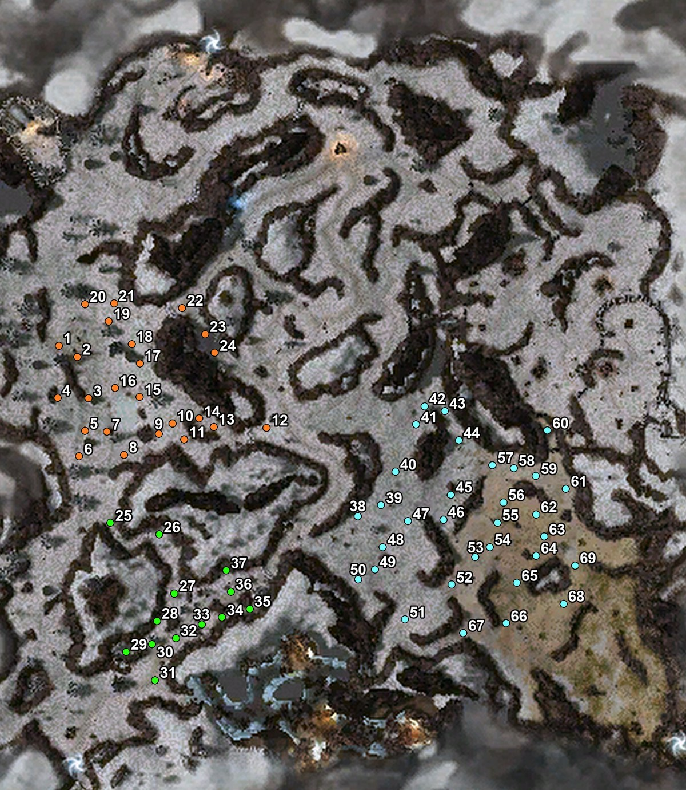

# Jormungand Texmod

A Guild Wars texture mod that marks and **numbers the known Frost Wurm spawn points** in Bjora Marches, based on player research. Any of them is a possible spawn location for the boss [Jormungand](https://wiki.guildwars.com/wiki/Jormungand).

Jormungand is one of the rarest bosses in Guild Wars, and his unique hammer, [Jormungand's Thunder](https://wiki.guildwars.com/wiki/Jormungand%27s_Thunder), is very hard to farm. With every spawn point on your map and numbered, you can sweep the area systematically and call out spots to your party.

**Download:** [`Jormungand_Numbered.tpf`](Jormungand_Numbered.tpf)

## What the colors mean

Player research has shown that multiple wurms may spawn in Bjora Marches, but at most one in each of the zones the colors represent. Each time you enter, every zone can hold a Frost Wurm, a Frozen Elemental, or nothing at all. Sometimes the wurm that spawns is the boss Jormungand himself, but there isn't enough data yet to find a reliable way to predict when.

The marker color shows which zone a spawn point belongs to:

| Color | Zone | Markers |
|---|---|---|
| Orange | North-west | 1–24 |
| Green | South-west | 25–37 |
| Blue | South-east | 38–69 |

The markers combine the spawn points from XTFOX's original Jormungand texmod with other community spawn maps, and include research done by Lynstyn and myself (Yen Odah). Spots that were almost identical were merged into one marker, placed halfway between them.

## How to hunt with it

There are two ways to hunt:

- **Orange zone only:** enter Bjora Marches from the **Jaga Moraine** portal and walk over the orange markers. The numbering is laid out for this route: it starts at the Jaga Moraine portal and covers only the orange zone (1–24). It's one possible route, not a recommendation.
- **All three zones:** for a full run, you can also start from **Longeye's Ledge**. The numbering isn't laid out for this route, so choose your own path through the orange, green and blue markers.

Good to know:

- Each visit gives up to three chances to encounter a wurm, one per zone: north-west (orange), south-west (green) and south-east (blue).
- If you see a Frozen Elemental or a normal Frost Wurm in a zone, Jormungand will not spawn there. This is the current working hypothesis and may still be proven wrong.
- While burrowed, wurms follow your group for a bit, so the exact spawn point may be slightly off a marker.

## Install

1. Download [`Jormungand_Numbered.tpf`](Jormungand_Numbered.tpf).
2. **GW Launcher:** put the file in the launcher's `plugins` folder (or add it under your account's mods) and start the game. **uMod / gMod / TexMod:** load the .tpf like any other texture mod.
3. Remove or disable the older `Jormungand.tpf` if you have it. Both replace the same map textures.
4. In Bjora Marches, open the world map (**M**) or the mission map (**U**). The numbered markers show on both.

### Conflicts

Map-wide texture packs such as *Borderless Cartography Made Easy* replace the same two Bjora Marches map textures. If both are loaded, only one shows. If you don't see the numbers, disable the other pack or change the load order.

## Credits

Created by **Yen Odah**, with the help of Claude.

### Thanks

This project builds on years of community wurm hunting.

**Special thanks to Lynstyn** for his research and tenacity.

**[The Hunt for Jormungand](https://guildwarslegacy.com/forum/thread/14789-the-hunt-for-jormungand/)** (Guild Wars Legacy forum):
- **XTFOX**: the original [Jormungand texmod](https://github.com/XTFOX/Jormungand) this mod is built on
- **Unholy**
- **Morythe Bly**: spawn research and zone notes

**Everyone on the [Guild Wars Wiki Jormungand discussion](https://wiki.guildwars.com/wiki/Talk:Jormungand)** who shared sightings, maps and tests from 2007 to 2021:
Axis, BeXoR, Chieftain Alex, Count Calixtus, DakotaThrice, Deehn, Goddess Serqet, Gordon Ecker, Hammstein, HeWhoIsPale, Khan Reaper Kerensky, Legionaireb, Lemming64, Lord Flynt, Lou-Saydus, Melon, Ouatis, Paddymew, Quetzal, Rainith, RhapsodyMoon, Rockon metal jay, Skallen640, The Magical Malice, Threid, Wikke, and 10 anonymous contributors.

Questions, feedback, or found a spawn that isn't on the map? Whisper `Yen Odah` in-game, or message [u/yen_odah](https://www.reddit.com/user/yen_odah) on Reddit.

## License

Released under the **GNU General Public License v3.0** (see [LICENSE](LICENSE)), the same license as the original Jormungand texmod it is based on.

Guild Wars, its imagery, map art, and data are trademarks and copyright of ArenaNet / NCSoft. This is an unofficial fan project and is not affiliated with or endorsed by ArenaNet or NCSoft. Use texture mods at your own risk.
